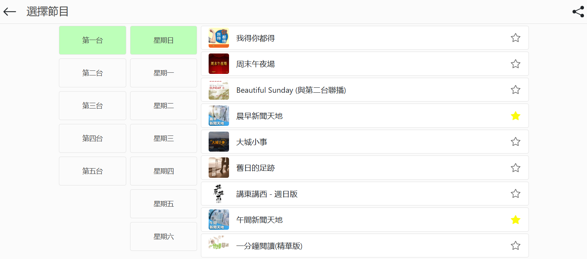

# React RTHK Archive

A web application to download archive radio programms from RTHK.


## Live Demo
<https://rthk-archive.vercel.app>

## Features

- **RTHK Radio Program Download**
- **Bookmark**
- **Mobile Friendly(responsive)**
- **3 Languages**

## Getting Started

These instructions will get you a copy of the project up and running on your local machine for development and testing purposes.

### Prerequisites

Before you begin, ensure you have the following installed:
- Node.js (>=18.x)
- npm (or yarn)
- A modern web browser that supports HTML5 and ES6+.

### Installation

Clone the repository to your local machine:

```bash
git clone https://github.com/drive2mobile/react_rthk_archive.git
cd react_rthk_archive
```

Install the necessary dependencies:

```bash
npm install
```

To run the application in development mode, execute:
```bash
npm start
```
